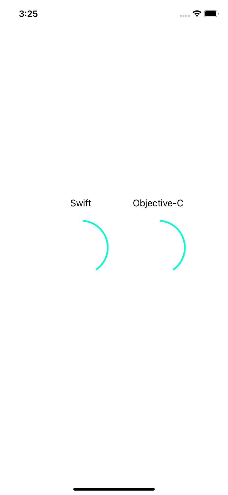

# SpinnerViewSample

**SpnnerViewSample** 은 [stackoverflow](https://stackoverflow.com/a/33455882)에서 알게된 `SpinnerView`  class 를 테스트해보기 위한 Swift 기반샘플 프로젝트입니다.

 `SpinnerViewObjC` 클래스는 **Swift**로 작성된 `SpinnerView`  코드를 **Objective-c** 전환작업을 한 클래스입니다.

